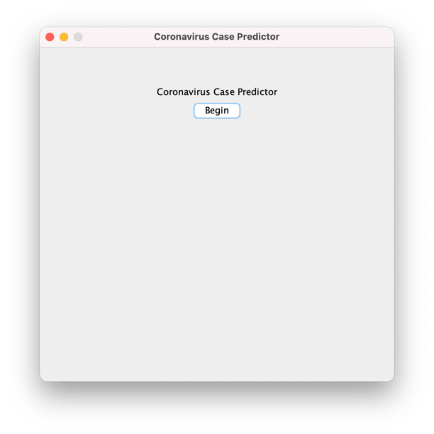
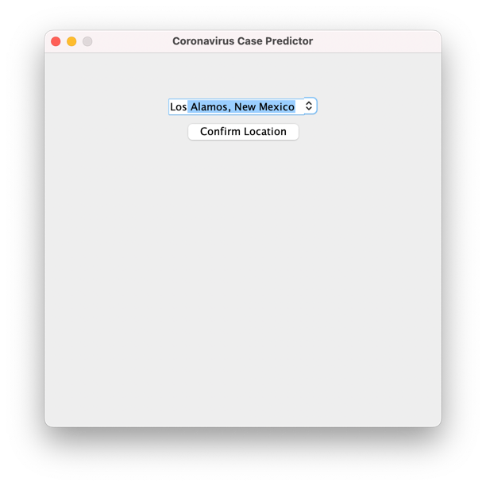
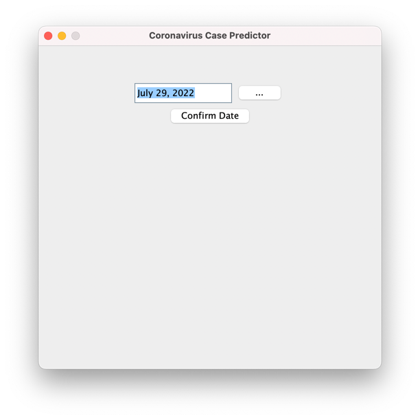
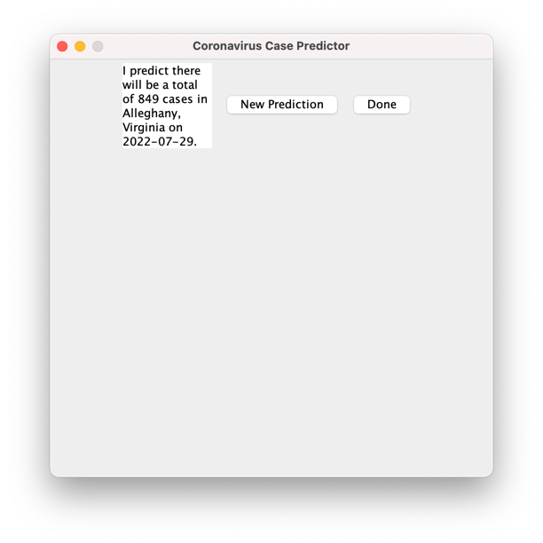

# caseforecaster
A COVID-19 Case Forecaster that uses different markers/attributes from around the US to predict future case count.

## Pre-requisites

- [Java SE Development Kit (JDK)](https://www.oracle.com/java/technologies/downloads/) v18.0.2 (if using a Mac, make sure to use the x86_64/Intel chip version)
- Maven ([Download](https://maven.apache.org/download.cgi) and [Install](https://maven.apache.org/install.html))


## Local Setup
1. Clone the repository
```
git clone https://github.com/mlabisi/casepredictor.git
```
2. Install dependencies and Compile
```
cd casepredictor
mvn clean install -U
```
3. Compile
```
mvn compile
```

## Running the Application
### GUI
casepredictor runs in this mode by default

```
mvn exec:java -Dexec.mainClass="edu.cpp.mslabisi.predict.CaseCountPredictor"
```

### CLI
```
mvn exec:java -Dexec.mainClass="edu.cpp.mslabisi.predict.CaseCountPredictor" -Dexec.args="--cli"
```

## Generating a Prediction


### Choose a location (State or County)


### Choose a date


### Read the prediction

